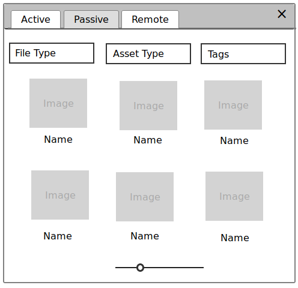

Asset Management
================

Asset Management handles creating, updating, and deleting assets prior to those
assets being loaded by end-users.  These assets are typically not associated to
a scene, object, or property.

Asset management functionality can serve a useful purpose in isolation, outside
of the rest of the BlenderSync functionality.  It can allow users to distribute
and utilize assets into a shared cloud environment, as well as tracking updates
and versions of these assets.

This add-on builds upon the upcoming Blender Asset Management by supporting
integration with Aesel servers for storing, accessing, and finding assets stored
in the cloud.

Basic Asset Management
----------------------

There are several distinct asset types that need to be considered:

* obj - Object(s) without animation
* fbx - Object(s) with animation
* blend - Blend file
* image - Image files of various sizes

In addition, users will be able to manipulate both local and remote assets.  Local
assets are exported and saved on disk, while remote assets are those that have
been pushed to an Aesel server.

Users should be able to select any number of Objects in the Blender UI, then export
to any asset format.  Once an object is exported, it will show up in the local assets
browser.

Local assets can be set to auto-sync with their remote counterparts, or require
manually pushing updates out to the remote server.

The UI is focused on the upcoming Asset Management functionality expected in Blender 2.81,
which displays Active Assets (assets currently present in the scene).
The browser will also be able to display Passive Assets (assets which are not
currently present in the scene), all with thumbnails.

Local Asset Folders
-------------------

Passive Local Assets should be displayed in folders, providing organization when
many assets are stored on the same system.  These folders should correspond with
folders on the physical file system.

Remote Asset Collections
------------------------

Remote Assets should be able to be organized into Collections, which can then
be viewed from within the Asset browser the same way that folders are viewed for
local assets.

Operators Overview
------------------

Local Asset Operators
~~~~~~~~~~~~~~~~~~~~~

* Selected to obj - Export the selected objects to .obj format, and add this as a local asset
* Selected to fbx - Export the selected objects to .fbx format, and add this as a local asset
* Selected to blend - Export the selected objects to .blend format, and add this as a local asset
* Asset to Cloud - Send the selected local Asset to the Aesel Server
* Assets to Cloud - Send all updated local Assets to the Aesel Server

Local and Remote Asset Operators
~~~~~~~~~~~~~~~~~~~~~~~~~~~~~~~~

* Generate Thumbnail - Generate a thumbnail for a selected asset from the current view
* Overwrite with Selected - Use the selected Objects to update the selected Asset
* Load Asset - Load the selected Asset into the current scene.  If it is a remote asset, load it as a local asset first
* Delete Asset - Delete the local files for an asset and, if present in the cloud, delete it there as well.

Remote Asset Operators
~~~~~~~~~~~~~~~~~~~~~~

* Filter Remote Assets - Query for Assets stored in the cloud

UI Elements Overview
--------------------

The Asset Management functionality planned in Blender 2.81 will be central to
the viewing and management of Assets.  This will serve as the central Asset Browser
for both local and cloud assets.

The Asset Browser is divided into 3 primary sections: Active Local Assets,
Passive Local Assets, and Passive Remote Assets.

The Local Assets browsers can be organized with folders, while the Passive
Remote Assets browser can be organized with collections.  Both should be
represented the same visually within the browser.

