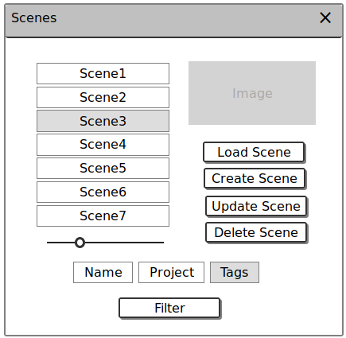

Scene Management
================

Scene Management involves finding Scenes on a remote server, performing CRUD operations
on those scenes, and loading scenes into the Blender interface.

Projects
--------

Scenes can be organized into Projects, and the Scene list is able to filter by
Project.  The Project Filter in the Scene list should be auto-populated by a
selection in the Project list.

Operators Overview
------------------

Project Operators
~~~~~~~~~~~~~~~~~

* Create Project - Create a new Project
* Update Project - Update the details of an existing Project
* Delete Project - Delete an existing Project
* Filter Projects - Filter the list of Projects by the specified filter

Scene Operators
~~~~~~~~~~~~~~~

* Load Scene - Load the selected Scene into the Blender interface
* Create Scene - Create a new Scene
* Update Scene - Update the details of an existing Scene
* Delete Scene - Delete an existing Scene
* Filter Scene - Filter the list of Scenes by the specified filter

UI Elements Overview
--------------------

There are two basic elements which need to be added to the UI: The Project List
and Scene List.  Both have the same basic structure, offering CRUD operations on
a list of data, as well as filtering and pagination.  The thumbnail of the selected
data element should also be displayed.

